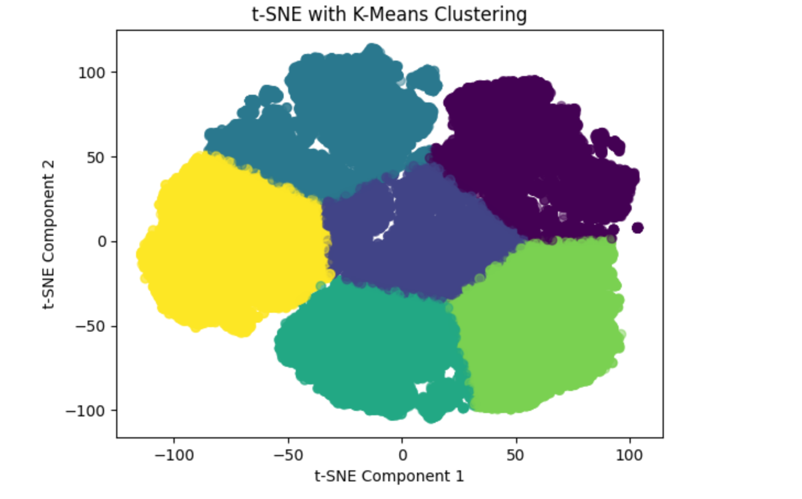
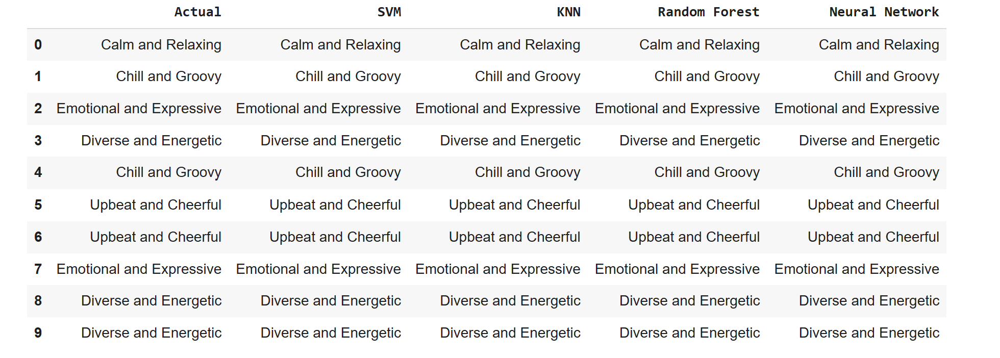

# Machine Learning Approach for Personalized Mood Detection on Spotify

## Team Members
- Rohan Pudipeddi
- Utsav Parekh
- Minita Joshee
- Tanya Sharma
- Priyal Dani

---

## Project Overview
This project explores machine learning techniques to detect personalized moods based on Spotify tracks. By analyzing audio features, clustering similar tracks, and applying classifiers, we aim to create a robust mood detection system.

---

## Dataset Overview
- **Total Records:** 130,663
- **Total Features:** 17
- **Features:**
  - `artist_name`: The name of the track's artist.
  - `track_id`: A unique identifier for the track.
  - `track_name`: The title of the track.
  - **Audio Features**:
    - `acousticness`: Measure of acoustic characteristics (0 to 1).
    - `danceability`: Indicates suitability for dancing (0 to 1).
    - `duration_ms`: Duration of the track in milliseconds.
    - `energy`: Perceptual measure of intensity and activity (0 to 1).
    - `instrumentalness`: Predicts whether the track is instrumental (0 to 1).
    - `key`: The key the track is in (numeric representation).
    - `liveness`: Detects the presence of an audience (0 to 1).
    - `loudness`: Overall loudness of the track in decibels (dB).
    - `mode`: Modality of the track (Major = 1, Minor = 0).
    - `speechiness`: Presence of spoken words (0 to 1).
    - `tempo`: Estimated tempo of the track in BPM.
    - `time_signature`: Estimated overall time signature of the track.
    - `valence`: Musical positiveness of the track (0 to 1).
    - `popularity`: Metric indicating the track's popularity.

---

## Data Preprocessing
- **Handling Missing Values**: Implemented KNN imputation.
- **Normalization**: Applied Min-Max scaling to numeric features.

---

## Dimensionality Reduction
**Method**: t-SNE (t-Distributed Stochastic Neighbor Embedding)  
- **Purpose**:
  - Simplify high-dimensional audio features into a 2D representation.
  - Preserve relationships between songs for better visualization and analysis.
- **Benefits**:
  - Identify patterns and groups within tracks.
  - Enable straightforward analysis of song relationships.

---

## Clustering
**Algorithm**: K-Means  
- **Steps**:
  1. Determined the optimal number of clusters using the elbow method.
  2. Grouped tracks into six clusters based on their features.
  3. Analyzed clusters and assigned manual mood labels.

---

## Classification Models
Trained and evaluated the following models on labeled data:
1. **Simple Vector Classifier**
2. **K-Nearest Neighbor (KNN)**
3. **Random Forest**
4. **Neural Network**

**Cross-Validation**: Applied stratified K-fold for robust evaluation.

---

## Results
- Compared predictions across all models to determine the best classifier for mood detection.

---

## Tools and Libraries
- **Data Preprocessing**: Python, Scikit-learn
- **Visualization**: Matplotlib, Seaborn
- **Clustering**: Scikit-learn (K-Means)
- **Dimensionality Reduction**: t-SNE implementation in Scikit-learn
- **Classification**: Scikit-learn (Random Forest, KNN), TensorFlow (Neural Networks)

---

## Conclusion
This project demonstrates the feasibility of using machine learning to predict personalized moods on Spotify by leveraging audio features and advanced classification techniques.

---

## Acknowledgments
We thank our mentors and peers for their support and guidance throughout this project.

---

## Visualizations
### t-SNE with K Means

### Model Cross Validation and Test Accuracy

### Comparison of Model Result

---

## Contact
For any inquiries, please reach out to our team.
